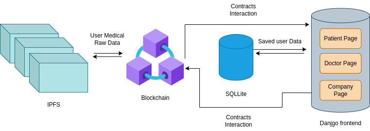
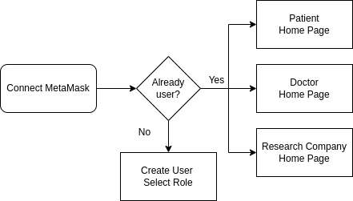
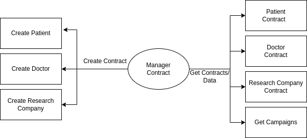
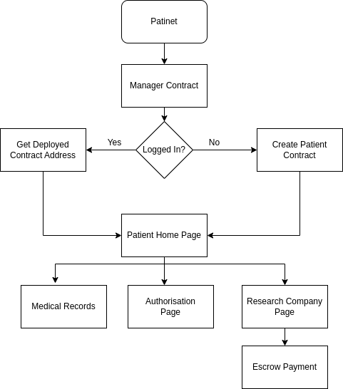
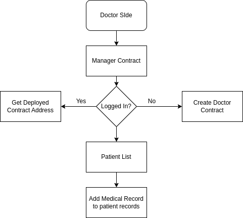
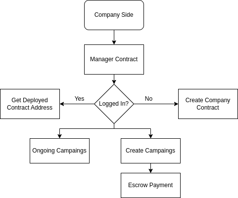

# Medisecure

## Problem Statement

Data is controlled by Big players.
User data is sold and used without their knowledge.
The patient to whom the data belong doesn't get any
monetary benefits.
The patient's medical history is not maintained.

## Solution
A decentralized platform to store and maintain patient
medical records.
Provide users with total control over their data with help of
smart contracts and permission-based data access
functionality.
Onboarding research houses, Drug development research, and
other such organizations.
Allowing patients to sell their data to orgs, using escrow smart
contract logic for payments.
Sharing old medical records with doctors.

### High level design

Below is a high level design of the system, how will it look with frontend and backend integrated.

Use of IPFS is to make sure that large files of patient is not directly stored on blockchain. SQL is will only be used to store login and other such data for simple user access.

## User Register workflow

# Contracts

From the developer side, we will only have to host the manager contract ourself, rest contract creation and deployment will be taken care by the users it self, also the deployment fees.
---
### Manager Contract

---
### Patient Contract

---

### Doctor Contract

---

### Research Company Contract

# Run Contracts

To run contracts in Remix IDE, you can follow these steps:

1. Open the Remix IDE: Visit the Remix IDE website at https://remix.ethereum.org/ to access the online Remix IDE or set up the Remix IDE locally on your machine.

2. Select the Solidity Compiler: On the left side of the IDE, you will find various panels. Click on the "Solidity Compiler" panel to access the compiler settings.

3. Choose Compiler Version: Select the desired Solidity compiler version from the dropdown menu. It is recommended to use a stable version that is compatible with your contracts.

4. Compile the Contract: In the "Solidity Compiler" panel, click the "Compile" button to compile your contract(s). You will see the compilation status and any errors or warnings in the "Compile" output area.

5. Deploy the Contract: After successful compilation, switch to the "Deploy & Run Transactions" panel. Here, you can select the appropriate environment (e.g., JavaScript VM, Injected Web3, etc.) based on your requirements.

6. Deploy the Contract: Click on the "Deploy" button in the "Deploy & Run Transactions" panel to deploy your contract. Make sure you select the correct contract from the dropdown menu if you have multiple contracts.

7. Interact with the Contract: Once the contract is deployed, you can interact with its functions and variables. The IDE provides a user-friendly interface to input function parameters and execute transactions.

8. View Transaction Details: After executing a transaction, you can view the transaction details, including gas cost, status, and events emitted by the contract.

9. Debug and Test: Remix IDE offers debugging and testing capabilities to help you identify and fix issues in your contracts. You can use breakpoints, step through the code, and inspect variables during execution.

10. Save and Export: You can save your work in Remix IDE by exporting the contract code, configurations, and settings. It allows you to easily resume your development in the future.

These steps should guide you through running contracts in Remix IDE. Make sure to familiarize yourself with the different panels and functionalities available in the IDE to utilize its full potential.